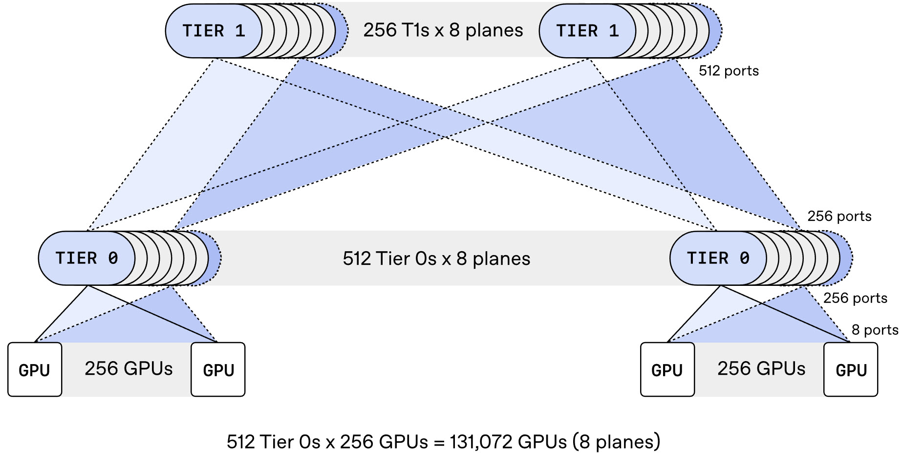
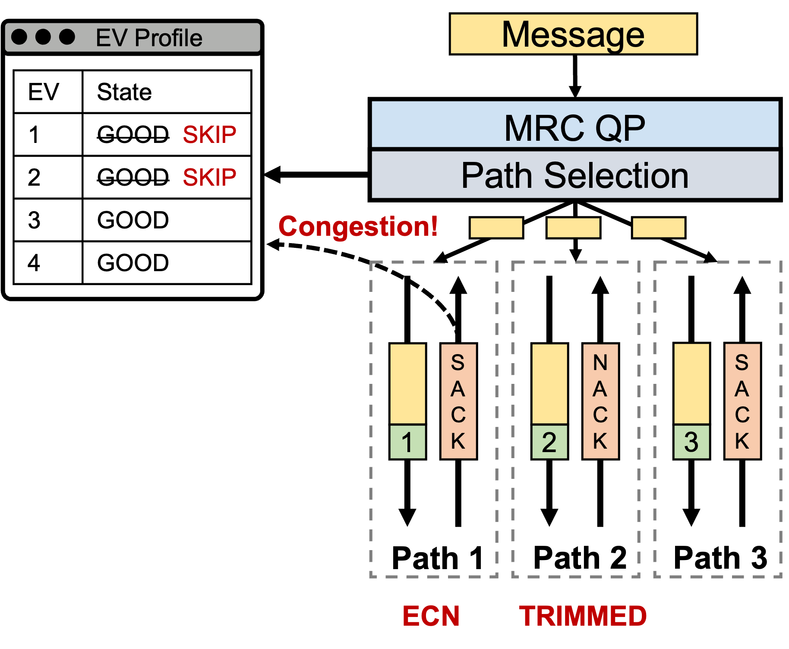
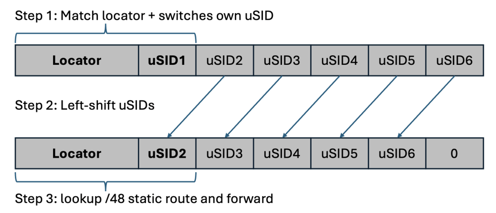
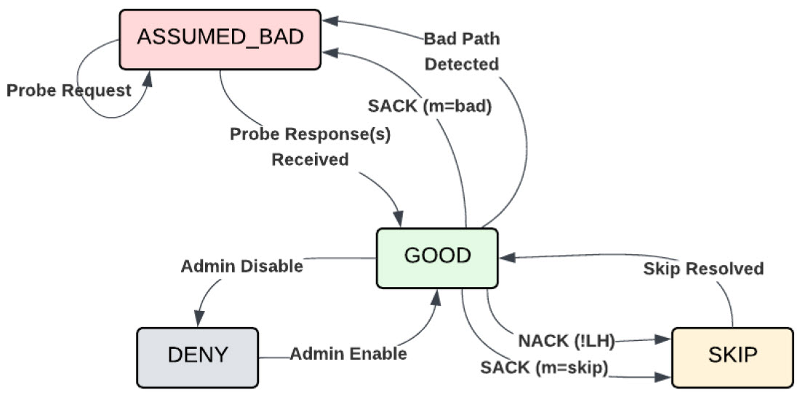
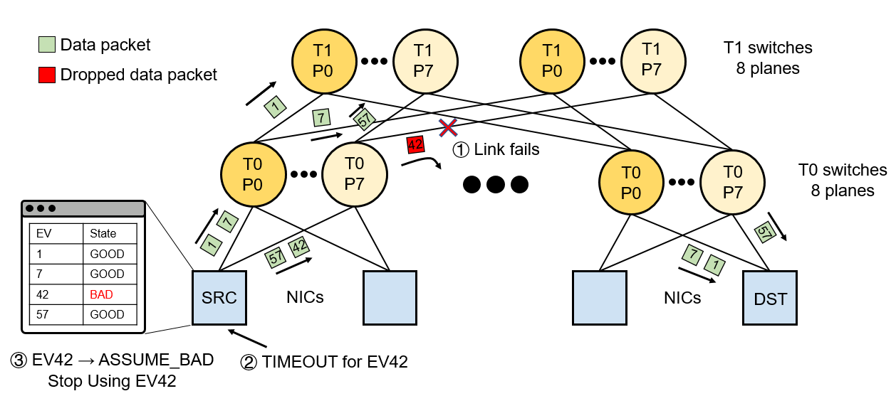
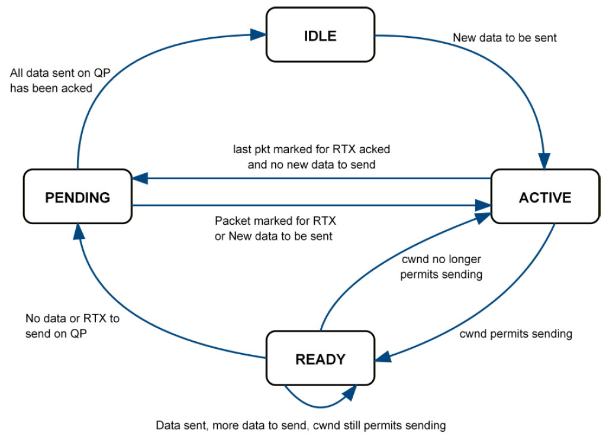

# Multipath Reliable Connection (MRC)

> **Prerequisites**: This document builds on RDMA, InfiniBand RC transport, and the RoCEv2 packet format. If you are new to these topics, start with the [RDMA Primer](https://github.com/ManiAm/RDMA-Primer) project, which covers the fundamentals. For the load-balancing problems that motivated MRC, see [Load Balancing for RoCEv2](./03_README_ROCE_LB.md).


## Overview

RoCEv2 carries InfiniBand packets over Ethernet by encapsulating them inside UDP/IP. The InfiniBand specification defines three primary transport services — Reliable Connection (RC), Unreliable Connection (UC), and Unreliable Datagram (UD) (see the [InfiniBand deep dive](https://github.com/ManiAm/RDMA-Primer/blob/master/docs/02_README_INFINIBAND.md#transport-services)) — and RoCEv2 reuses them unchanged. RC is the one that matters here: it is the connection-oriented service that guarantees every byte is delivered exactly once and in order, and it is what distributed training frameworks are built on.

**Multipath Reliable Connection (MRC)** extends the RC service so that a single connection can use many network paths at once. It is defined exclusively for the RoCEv2/Ethernet context: it is not a new InfiniBand transport service, and it does not run over native InfiniBand fabrics.

MRC was initiated by OpenAI in late 2023 and developed over two years in collaboration with AMD, Broadcom, Intel, Microsoft, and NVIDIA. OpenAI led the protocol design — building on Mark Handley's earlier research on packet spraying and trimming in [NDP](https://dl.acm.org/doi/10.1145/3098822.3098825) — and drove the production deployment, while AMD, Broadcom, and NVIDIA implemented MRC in their respective NIC hardware, Microsoft contributed deployment requirements and architectural feedback from hyperscale AI infrastructure, and Intel participated in the specification process.

MRC builds on the [UltraEthernet Transport Specification](https://ultraethernet.org/) (UET 1.01), which it references for congestion control, packet trimming behavior, and several protocol details. The two are related but not the same thing: UET defines an entirely new transport with its own packet formats, whereas MRC keeps the InfiniBand headers that RoCEv2 already carries and adds multipath behavior around them. That is a deliberate choice — it lets MRC borrow UET's best ideas while remaining a comparatively small change to existing RDMA hardware and software stacks.

MRC is implemented in 400 and 800 Gb/s NICs — NVIDIA ConnectX-8 and ConnectX-9, AMD Pollara and Vulcano, and Broadcom Thor Ultra — and has been deployed in production across OpenAI's largest training clusters, Microsoft's Fairwater data centers, and Oracle Cloud Infrastructure's Abilene facility, where it has been used to train frontier large language models. That deployment experience was formalized as an [open specification](https://www.opencompute.org/documents/ocp-mrc-1-0-pdf) (Revision 1.0) through the Open Compute Project (OCP) in March 2026. The companion paper [*Resilient AI Supercomputer Networking using MRC and SRv6*](https://arxiv.org/abs/2605.04333) followed in May 2026 with a detailed account of the protocol design and production results.


## Why Standard RoCEv2 Breaks at AI Scale — and How MRC Fixes It

Standard RoCEv2 RC was designed for a small number of well-behaved connections on a lossless fabric. AI training violates every one of those assumptions. This section traces the chain of problems, each leading to the next, and the corresponding MRC solution. Later sections expand on each mechanism in detail.

### 1. The Lossless Fabric Problem

RoCEv2 inherits InfiniBand's assumption of a **lossless** fabric — one where credit-based flow control ensures a sender never transmits a packet the receiver cannot buffer. Ethernet, however, is inherently **lossy**: switches drop packets when buffers overflow.

To bridge this gap, the industry developed [Priority Flow Control (PFC)](https://github.com/ManiAm/GNS-QOS/blob/master/docs/04_PFC.md), part of the Data Center Bridging (DCB) Ethernet extensions. PFC allows a switch to send a pause frame to an upstream port, telling it to stop transmitting until the buffer drains. This prevents drops and gives RoCEv2 the lossless environment it expects.

**The complication**: PFC pauses an *entire priority group* on an ingress port, not a specific flow. In a typical RoCEv2 deployment all RDMA traffic shares a single lossless priority group, so when one flow causes congestion, every other RDMA flow in the same group on that port is paused too — even if those flows are headed to completely different destinations. In large fabrics this causes [head-of-line blocking and congestion spreading](https://github.com/ManiAm/GNS-QOS/blob/master/docs/04_PFC.md#the-dangers-of-pfc-managing-the-lossless-safety-net) — a single hotspot cascades pause frames across the network, stalling unrelated traffic. At AI training scale, with thousands of flows converging on shared links, PFC storms become a serious source of **tail latency** — the delay of the slowest operations rather than the average one. Tail latency is what dictates overall job speed, because a synchronous training step cannot complete until its slowest participant finishes.

**MRC's fix**: Disable PFC entirely and run Ethernet in its natural best-effort (lossy) mode. MRC uses **packet trimming** and **selective retransmission** to handle losses cheaply, as described in [Running on Lossy Ethernet](#running-on-lossy-ethernet) and [Reliable Delivery Without Ordering](#reliable-delivery-without-ordering).

### 2. The Load Balancing Problem

In a **leaf-spine fabric** — the standard two-tier data center design in which every leaf (top-of-rack) switch connects to every spine switch, so that any pair of endpoints has many equal-cost paths between them — **Equal-Cost Multi-Path (ECMP)** routing distributes traffic by hashing each packet's **5-tuple** (source IP, destination IP, source port, destination port, and protocol number) to select an output port. RoCEv2 generates its entropy through the **UDP source port**, which is derived once per **Queue Pair (QP)** — the send/receive queue pair that forms one endpoint of an RDMA connection — at connection setup. Every packet in that QP carries the same 5-tuple, so every packet follows the exact same path (see [RoCEv2 Entropy: The UDP Source Port](./03_README_ROCE_LB.md#rocev2-entropy-the-udp-source-port)).

This per-QP path pinning is adequate when the fabric carries thousands of small, short-lived flows — the statistical diversity naturally balances the load. AI training traffic is the opposite: a small number of massive, long-lived connections (**elephant flows**) that individually consume an entire link's capacity (see [Why This Breaks at AI Scale](./03_README_ROCE_LB.md#why-this-breaks-at-ai-scale)). When two elephant flows hash to the same spine link, that link becomes a bottleneck while neighboring links sit idle. ECMP has no feedback loop and no ability to rebalance, and the conventional workaround — [QP scaling](./03_README_ROCE_LB.md#qp-scaling-mqp-the-software-workaround) (splitting a transfer across multiple QPs) — has diminishing returns beyond 8 QPs.

**MRC's fix**: Replace per-QP entropy with **per-packet entropy**. Each packet carries a different **Entropy Value (EV)** so that a single QP's traffic is sprayed across hundreds of paths. The mechanism is detailed in [Entropy Values and Packet Spraying](#entropy-values-and-packet-spraying).

### 3. The Ordering Problem

Spraying solves load balancing, but it creates a new problem: packets now take paths of different lengths and congestion levels, so they arrive **out of order**. Standard RC cannot tolerate this. The RDMA Extended Transport Header (RETH) — which carries the destination memory address — appears only in the **first** packet of a message. Every subsequent packet is a bare payload fragment that depends on arriving in sequence so the receiver can write it to the correct memory offset (see [The RC Ordering Constraint](./03_README_ROCE_LB.md#the-rc-ordering-constraint)). An out-of-order packet looks identical to a lost one, triggering **Go-Back-N** retransmission — resending the whole stream from the missing packet onward — and collapsing throughput.

**MRC's fix**: Include the **full RETH in every data packet**, so each packet is self-describing and can be written to the correct memory offset the instant it arrives, regardless of order. The full mechanism is described in [Reliable Delivery Without Ordering](#reliable-delivery-without-ordering).

### 4. The Retransmission Problem

Running on lossy Ethernet (because MRC disabled PFC) means packets *will* occasionally be dropped — by congested switches, by bit errors, or by **link flaps** (links that repeatedly go down and come back up). RC's only recovery is the same Go-Back-N retransmission [described above](#3-the-ordering-problem), which amplifies every single drop into a burst of redundant retransmissions, wasting substantial bandwidth at high line rates.

**MRC's fix**: **Selective retransmission** using SACK (Selective Acknowledgment) bitmaps. The receiver tells the sender exactly which packets arrived and which are missing, and the sender retransmits only the missing ones. This is the single largest performance difference between MRC and standard RC, detailed in [Selective Retransmission (SACK and NACK)](#selective-retransmission-sack-and-nack).

### 5. The Congestion Control Problem

RoCEv2 uses [DCQCN](https://github.com/ManiAm/GNS-QOS/blob/master/docs/05_DCQCN.md) (Data Center Quantized Congestion Notification) for congestion control. DCQCN reacts to **Explicit Congestion Notification (ECN)** marks from switches by reducing the sender's overall injection rate. It has two limitations at AI scale: first, it can only slow the sender down globally — it cannot redirect traffic away from a congested path to a healthy one. Second, it is notoriously difficult to tune, because optimal parameters are traffic-pattern-specific; some hyperscalers have disabled it in production entirely.

**MRC's fix**: **NSCC (Network-Signalled Congestion Control)**, a window-based algorithm that combines ECN marks and measured RTT (round-trip time) to adjust how much data the sender may keep in flight. Unlike DCQCN, MRC can both reduce the sending rate *and* steer traffic away from congested paths. The algorithm is described in [Congestion Control (NSCC)](#congestion-control-nscc).

### 6. The Failure Recovery Problem

When a link fails in a standard RoCEv2 network, recovery depends on the routing protocol (typically BGP — Border Gateway Protocol, the standard inter-switch routing protocol in data center Ethernet) detecting the failure, withdrawing affected routes, and reprogramming forwarding tables across the fabric. This takes seconds — an eternity for a synchronous training job where the slowest node dictates overall performance. During reconvergence, affected QPs stall and may time out entirely, crashing the job.

**MRC's fix**: A **per-EV state machine** that tracks the health of every path individually. Failover happens in tens of microseconds, and recovered paths rejoin automatically. There is no routing reconvergence to wait for, because the sender picks the path itself instead of leaving that decision to the switches. The state machine and recovery mechanisms are covered in [Adaptive Path Selection](#adaptive-path-selection).


## Deliberate Scope Restriction

MRC supports only **RDMA Write** and **Write-with-Immediate (WriteIMM)** operations. RDMA Write places data directly into a specified region of the remote node's memory without involving its CPU. WriteIMM does the same but additionally delivers a small immediate-data value that generates a completion notification on the receiver, signaling that new data has arrived. Read, Send, and Atomic operations are not supported. This is intentional: Write and WriteIMM are the operations that dominate collective communication — the coordinated data exchanges (such as all-reduce and all-gather) among all participants in a distributed training job — through libraries such as NVIDIA's **NCCL** (NVIDIA Collective Communications Library), so dropping the rest allows substantial transport simplification with no practical impact on training workloads.

Because only Write operations remain, application data always travels in one direction: from the **requestor**, the side that issues operations and sends data, to the **responder**, the side that receives it and returns acknowledgments. These are the standard InfiniBand terms for the two ends of a connection. This document uses them wherever the protocol distinction matters, and the plainer "sender" and "receiver" elsewhere; they refer to the same two NICs either way.

Two further limitations follow from the same simplification. The number of in-flight WriteIMM operations is bounded by responder-side tracking resources, and there is no RNR-NAK (Receiver Not Ready) flow control — the standard RC mechanism that pauses a sender when the receiver's work queue is temporarily full. Both are revisited in [Out-of-Order Delivery with Immediate Memory Placement](#out-of-order-delivery-with-immediate-memory-placement).


## Anatomy of an MRC Packet

MRC keeps RoCEv2's encapsulation, so an MRC packet is an ordinary UDP/IP packet whose payload is an InfiniBand packet. Later sections examine individual headers where they matter — the RETH under out-of-order placement, the TSETH under congestion control — so it is worth seeing the whole stack once first.

```text
Ethernet │ IPv4/IPv6 │ UDP │ BTH │ METH │ [TSETH] │ RETH │ [ImmDt] │ Payload │ ICRC
                             └── InfiniBand transport headers ───┘

Square brackets mark headers that appear only in some packets.
```

| Header | Present in | What it carries |
|--------|------------|-----------------|
| **BTH** (Base Transport Header) | Every packet | The opcode, the destination QP number, and the 24-bit **PSN (Packet Sequence Number)**. MRC adds an `rtx` flag that marks a packet as a retransmission, and a separate flag indicating whether a TSETH follows. MRC also uses its own opcode range, so MRC packets are distinguishable from standard RC on the wire. |
| **METH** (Message Extended Transport Header) | Every request packet | A Message Sequence Number (MSN) and a Receive Queue MSN (RQMSN). The RQMSN is meaningful only for WriteIMM; see [Out-of-Order Delivery](#out-of-order-delivery-with-immediate-memory-placement). |
| **TSETH** (Timestamp Extended Transport Header) | Optional, per packet | A 16-bit transmit timestamp that the responder reflects back to the requestor, used to measure round-trip time (see [The Two Network Signals](#the-two-network-signals)). |
| **RETH** (RDMA Extended Transport Header) | Every request packet | The destination virtual address, R_Key, and DMA length. Standard RC carries this only in the first packet of a message; carrying it in *every* packet is the change that makes out-of-order delivery workable. |
| **ImmDt** (Immediate Data) | WriteIMM only | The 32-bit immediate value handed to the receiving application. |
| **ICRC** (Invariant CRC) | Every packet | The end-to-end integrity check, computed per the InfiniBand Trade Association specification. |

Control packets — SACKs, NACKs, and probes — reuse the same outer encapsulation but carry no application data. Each consists of a BTH followed by a small control header as its payload: SETH for a SACK, NETH for a NACK, PETH for a reliability probe, and ERTH for the connectionless [Endpoint Operations](#failure-detection-and-recovery).

Two fields outside the InfiniBand headers matter as much as anything inside them. The **UDP source port** and, on IPv6, the **flow label** are where the sender writes the value that chooses the packet's path. That value is the subject of the next several sections.


## Multi-Plane Topology

MRC was co-designed with a specific physical topology that maximizes the benefit of packet spraying. Understanding this topology is essential context for the sections that follow.

Instead of treating an 800 Gb/s NIC as a single high-speed link, the NIC is *broken out* into several smaller links. Two breakout configurations are deployed in production: **8 × 100 Gb/s** and **4 × 200 Gb/s**. Each link connects to a different **Tier 0 (T0)** switch — the top-of-rack tier, which is the same thing as the leaf tier in leaf-spine terminology. (From here on this document uses the tier numbering: T0 for leaf, T1 for spine, and T2 for a third tier where one exists.) The result is multiple **independent parallel networks**, called **planes**, that share no switches with one another. In MRC's device model, each physical NIC port (called a *panel port* in the specification) maps directly to one plane, and every port is exposed as a separate PCIe (Peripheral Component Interconnect Express) *physical function* — an independent device as far as the host is concerned — with its own network interface and management IP address.

Breaking out the ports also multiplies the usable **radix** — the total number of ports available on a switch — of each switch. A 51.2 Tb/s switch offers 64 ports at 800 Gb/s but 512 ports at 100 Gb/s. With 512-port switches and an 8-plane breakout, a two-tier **Clos topology** — a scalable, non-blocking network architecture built from identical switch stages, where every input can reach every output at full bandwidth — can connect over **131,000 GPUs**. That scale would otherwise require three or four tiers.



The diagram walks through the 8-plane topology from bottom to top. At the bottom, each GPU node has a single 800 Gb/s NIC broken out into **8 × 100 Gb/s ports** (one per plane). Each port connects to a different Tier 0 (T0) switch, shown as a stack of 8 in the middle row — one switch per plane, so each stack represents 8 independent T0 switches that share no hardware with one another. Each T0 switch has **512 ports**: 256 downlinks to GPU nodes and 256 uplinks to Tier 1 (T1) switches above. At the top, T1 switches are also stacked 8 deep (one per plane), each with 512 ports connecting down to T0 switches. The shaded bands between the tiers represent the 8 separate planes — each is a physically independent network.

The bottom line of the diagram confirms the resulting scale: **512 T0 switches per plane × 256 GPUs per T0 = 131,072 GPUs** in a two-tier fabric. Note that this is the total GPU count, not a per-plane count: every GPU has exactly one port into each plane, so all 8 planes serve the same 131,072 GPUs, using 4,096 T0 switches in total.

That reduction in tiers is where most of the benefits come from:

- **Lower latency**: The longest path traverses 3 switches instead of the 5 or 7 needed by a deeper topology.

- **Locality**: Many more nodes are reachable in one hop (256 under a single T0 switch, versus 32 at 800 Gb/s), making it easier to exploit locality in job placement and reducing load on T0 uplinks.

- **Reduced cost and power**: A two-tier multi-plane network needs roughly 60% of the switches and 67% of the optics of an equivalent three-tier single-plane network.

- **Higher redundancy**: A single T0–T1 link is a much smaller fraction of the whole. In an 8-plane network it is 1 of the 256 uplinks on a T0 switch, roughly 0.4% of that switch's upward capacity, versus 1 of 32 — about 3% — in a single-plane design.

- **Graceful NIC port failure**: If one of eight NIC ports fails, the node loses only 12.5% of its bandwidth rather than all connectivity. With a 4-plane breakout the loss is 25%, still far better than losing the entire connection. MRC detects the failure and keeps the job running, as described in [Failure Detection and Recovery](#failure-detection-and-recovery).


## Entropy Values and Packet Spraying

The most fundamental change in MRC is the elimination of single-path flow pinning.

In networking, **entropy** refers to the variable header bits a switch feeds into its load-balancing hash. Standard RoCEv2 derives those bits once per QP, which is exactly why every packet of a QP follows the same route (see [RoCEv2 Entropy: The UDP Source Port](./03_README_ROCE_LB.md#rocev2-entropy-the-udp-source-port)). MRC makes entropy a per-packet property instead.

An **Entropy Value (EV)** is the value a sender stamps into each packet to choose that packet's path; the specification defines it simply as a *multipath selector communicated via various fields in the packet*. An EV is a **32-bit value**: that is the width stored in an EV profile, and the width of the reflected `entropy` field that each SACK and NACK carries back to the sender, which is what lets feedback be attributed to a specific path. How many of those 32 bits actually reach the wire is a separate question, and depends on the fabric.

### EV Profiles and the Active Set

EVs are grouped into an **EV Profile**, and every QP is associated with exactly one profile whose size is fixed for that profile's lifetime. The profile holds the **EV Universe** — the complete set of EVs the QP may ever use — partitioned into **Active EVs**, which are eligible for transmission, and **Inactive EVs**, which are not.

At QP startup the EV set is generated: typically 128 to 256 entries in total, of which somewhat more than 100 are active and the remainder are held in reserve. Generation draws an equal number of EVs from each plane so that traffic is balanced at the plane level from the very first packet, then picks a random subset of paths within each plane.

The size of the active set is a deliberate trade-off. Too few EVs and the QP cannot spread across enough paths to balance the fabric; too many and each individual path is used so rarely that feedback about it arrives too late to act on. The specification therefore recommends sizing the active set to roughly one or two **congestion windows**' worth of packets — a congestion window is the byte limit on how much data a sender may keep in flight, detailed in [Congestion Control (NSCC)](#congestion-control-nscc) — so that every active path is exercised at least once per round trip and its SACKs stay timely. It notes rapidly diminishing returns beyond about 100 active EVs.

Profiles are created through a privileged per-node host daemon called the **MRC Controller**. Whether the controller computes the EV values itself or only tells the NIC how to derive them depends on the profile's mode — a choice that interacts with the forwarding model, so [Provisioning the EV Set](#provisioning-the-ev-set) takes it up once all three routing modes have been introduced.

Alongside the active set, the sender keeps a **backup EV set**: healthy reserve EVs that are held out of rotation. These are part of the inactive portion of the universe, alongside EVs that have been taken out of service for the reasons covered in [The EV State Machine](#the-ev-state-machine). When MRC concludes that a path is bad, it removes that EV from the active set and promotes a backup EV **from the same plane** — never from a different one, even if a different plane looks less loaded. [Inter-Plane Loading](#inter-plane-loading) explains why that restriction is worth its apparent cost.

### Spraying in Practice

When transmitting, the sender rotates through its active EV set, stamping a different EV into each packet. This is called **spraying**: what was a single elephant flow pinned to one link becomes a fine-grained stream distributed evenly across the whole fabric. Because the granularity is a single packet rather than a whole flow, load balancing is as fine-grained as it can possibly be.

One complete pass through the active set is a **rotation**. The term matters for the sections that follow, because several of MRC's reactions to congestion are scoped to roughly one rotation: an EV that is bypassed is skipped for the remainder of the current pass and becomes eligible again on the next one.

The order of that pass is deliberately not fixed. The specification leaves rotation order to the implementation but recommends making EV selection pseudo-random, and re-randomizing the scan order periodically. Two problems motivate this. Under source routing, different QPs drawing from the same profile in the same order would synchronize onto the same paths at the same time, undoing the balancing that the profile was built to provide. And a fixed order can alias against the pattern in which transmit ports become free, so the same few EVs are consistently the ones available when the scheduler asks. Because senders do not coordinate with one another at all, randomization is the only thing preventing these accidental correlations; the aggregate effect across hundreds of QPs then distributes load naturally.

Spraying is what makes MRC effective, but it also breaks two assumptions that standard RC relies on. Packets now arrive out of order, and a single connection now touches many links, so congestion and failure become per-path conditions rather than per-connection ones. Those two consequences account for most of what remains of this document: the first is answered by [Reliable Delivery Without Ordering](#reliable-delivery-without-ordering), the second by [Adaptive Path Selection](#adaptive-path-selection).

### The Feedback Loop in Action

Everything above describes one direction of travel. What makes spraying *adaptive* rather than merely random is the feedback that comes back along each path, and the simplest way to see how the pieces fit is to follow a single message through a complete cycle.



On the left, the **EV Profile** holds four EVs (numbered 1 through 4), each initially in the GOOD state. A message arrives at the MRC QP, and the **Path Selection** stage assigns a different EV to each outgoing packet — the first packet gets EV 1, the second gets EV 2, the third gets EV 3. Because each EV maps to a different network path, the three packets are sprayed across three separate paths (EV 4 is still available in the profile for subsequent packets).

Once the packets reach the receiver, feedback flows back along each path independently. Two kinds appear here: a **SACK** is the receiver's positive report of which packets arrived, and a **NACK (Negative Acknowledgment)** is an explicit report that something went wrong, carrying a reason code.

- **Path 1** (EV 1): The receiver returns a SACK confirming the data arrived, but the SACK carries an **ECN** mark — a switch along this path flagged its queue as building up. This is mild congestion: the data got through, but the path is getting busy.

- **Path 2** (EV 2): The receiver returns a NACK with reason `TRIMMED` — a switch along this path ran out of buffer space, stripped the packet's payload, and forwarded only the header. The data must be retransmitted.

- **Path 3** (EV 3): The receiver returns a clean SACK with no congestion signals. This path is healthy.

Both congestion signals feed back into the EV Profile (the dashed "Congestion!" arrow): EV 1 and EV 2 are moved from GOOD to **SKIP**, so subsequent packets bypass those two paths for the current rotation. EVs 3 and 4 remain GOOD, and traffic shifts to them. On the next rotation the SKIP EVs automatically return to GOOD and are tried again.

That is the whole loop: spray, observe per-path feedback, demote the paths that report trouble, and retry them once they have had a chance to recover. Each signal it depends on — [trimming](#packet-trimming), [SACKs and NACKs](#selective-retransmission-sack-and-nack), [ECN](#ecn-as-a-load-balancing-signal), and the [EV state machine](#the-ev-state-machine) itself — gets its own treatment later.


## Routing Modes

The EV is the same 32-bit value whichever forwarding model is in use. What a forwarding model decides is how those 32 bits become an actual path: which header fields the network reads, how wide a path encoding those fields can express, and how much control the sender has over the result. MRC defines three such models: ECMP, Structured EV, and SRv6. The largest production deployments use SRv6, the most capable of the three, but the other two matter because they let MRC run on fabrics whose switches cannot do SRv6 forwarding.

### ECMP

In ECMP mode the switches are entirely unmodified. They apply their ordinary ECMP hash and pick a next hop exactly as they would for any other IP traffic. All of the multipath behavior comes from the NIC changing the fields that feed that hash.

#### What the sender writes into each packet

Every QP is bound to an EV profile, and the sender rotates through the active subset of that profile, using a different EV for each packet (see [EV Profiles and the Active Set](#ev-profiles-and-the-active-set)). On IPv6 the 32-bit EV is *striped* across two header fields: the low 16 bits go into the 16-bit UDP source port, and the high 16 bits go into the low 16 bits of the 20-bit IPv6 flow label (the flow label's remaining 4 bits are left unused).

IPv4 has no flow label, so the source port is the only carrier and only the low 16 bits of the EV can be transmitted. The upper 16 go unused, and the number of distinct EVs the sender can express falls from 2³² to 2¹⁶. The EV does not become a 16-bit object, though: it is still a 32-bit value in the profile and in the `entropy` field of every SACK and NACK, and the specification requires the responder to zero-fill any entropy field the request did not carry. In an ECMP fabric the loss costs little — 65,536 distinct values is still far more than the 128 to 256 EVs an active set holds, and more than the number of physical paths the fabric offers.

Those two fields are the only ones available, because everything else a switch hashes is fixed for the life of the connection. The source and destination IP addresses identify the two NIC ports, the UDP destination port is the well-known RoCEv2 port 4791 (configurable, but fixed for a given deployment), and the protocol number is always UDP. The source port and flow label are the only fields the transport can change freely without altering what the packet means. This is why RoCEv2 has always used the UDP source port for entropy; MRC's contribution is to vary it on every packet instead of deriving it once per QP.

#### What the switch does with it

On IPv4 the switch hashes the standard 5-tuple. Four of those five fields are constant for the QP, so the source port is the only term that moves, and rotating the EV is precisely what shifts a packet from one hash bucket to another.

On IPv6 there is no standard "6-tuple," and the behavior is configuration-dependent. [RFC 6438](https://www.rfc-editor.org/rfc/rfc6438.html) describes hashing the 3-tuple of source address, destination address, and flow label — attractive because the flow label is at a fixed offset, whereas reaching the UDP ports means walking a chain of IPv6 extension headers. Most data center ASICs hash the 5-tuple and can optionally fold the flow label in. The distinction matters in practice: if the fabric is not configured to include the flow label in its hash, the 16 EV bits placed there have no effect on forwarding, and MRC's effective entropy silently falls back to the 16 bits in the source port.

#### How stable is an EV's path?

Hashing is deterministic, so identical header fields arriving at an unchanged switch always produce the same bucket, and every packet carrying a given EV follows the same physical path end to end. The specification states the guarantee carefully: without knowledge of the hash function and switch configuration the sender does not know precisely which path an EV takes, but absent failures it can expect that path to be stable on timescales far longer than a message transfer.

The binding is not permanent, though. If an ECMP group changes membership — a link goes down, a route is withdrawn, a switch reboots — the hash redistributes and EVs silently land on different paths. Nothing notifies the endpoint. This is the interaction that motivates [disabling dynamic routing](#srv6-source-routing) when SRv6 is available.

#### What this mode gives up

ECMP detects trouble on a path as reliably as any other configuration: a NACK or an ECN-marked SACK names the EV that ran into it, and the sender can stop using that EV. What it cannot do is say what that EV actually traversed, because the EV-to-path mapping lives inside a switch hash the endpoint cannot see. Four limitations follow from that one blind spot.

- **Path coverage is statistical, not guaranteed.** Two different EVs can hash to the same bucket, so N active EVs do not produce N distinct paths. Some links carry double share while others go untouched, and the sender has no way to detect the overlap or correct for it.

- **A bad EV cannot be localized.** When an EV starts reporting failures, the sender learns only that *something* on an unknown path is broken. It can retire the EV, but neither it nor an operator can name the link or switch that was actually at fault.

- **Denylists cannot be precomputed.** A [denylist](#startup-path-discovery) is a set of EVs excluded from the active set up front, before any traffic is sent, so that known-bad paths are never tried. Building one requires knowing which EVs traverse a given link. Under ECMP that is unknowable, so if monitoring reports a failed link the denylist mechanism has nothing to act on, and recovery is limited to discovering bad paths by losing packets on them.

- **EV values have no fabric-wide meaning.** Because the hash input includes the source and destination addresses, the same numeric EV maps to different paths for different sender/receiver pairs. Health information cannot be shared or aggregated across nodes.

The upside is the reason the mode exists at all: it needs no switch changes beyond standard ECMP support, which makes it by far the simplest to deploy and the only option on a fabric whose switches cannot parse structured entropy or forward SRv6.

### Structured Entropy Values

Structured EV uses exactly the same two header fields as ECMP — the 16-bit UDP source port and the low 16 bits of the IPv6 flow label — but asks the switches to *parse* those bits instead of hashing them. That single change buys source-routing-like determinism without any encapsulation. The 32-bit entropy field is partitioned into per-hop subfields, one for each network tier:

```text
Example: 3-hop topology with 10-bit, 8-bit, and 4-bit subfields

  ┌──────────┬────────┬──────┬──────────┐
  │  hop0    │  hop1  │ hop2 │ reserved │
  │  (10b)   │  (8b)  │ (4b) │  (10b)   │
  └──────────┴────────┴──────┴──────────┘
   T0 switch  T1 switch  T2 switch

Each switch examines its designated hop subfield to select an egress port.
```

The number of subfields, their widths, and their valid value ranges are fixed at deployment time and known to all endpoints and switches. Each switch maps its own subfield to an egress port using Access Control Lists (ACLs) or static forwarding tables. The sender therefore chooses the egress port at every tier on the ascent, using only standard L3/L4 header fields and with no encapsulation overhead. Once the packet reaches the top-tier switch the subfields are exhausted and ordinary IP routing carries it down to the destination, exactly as in ECMP mode.

Because the sender picks each hop explicitly rather than hoping a hash spreads its packets evenly, Structured EV eliminates the hash collisions that leave ECMP's path coverage statistical. What it does not provide is SRv6's fabric-wide addressing: a subfield names an egress port *relative to whichever switch reads it*, so an EV still has no meaning outside the sender that generated it, and health data still cannot be aggregated across nodes.

This is the mode that suffers most on an IPv4 fabric. With no flow label, the entropy field halves to the 16 bits of the UDP source port, and those 16 bits must still be divided among every tier — often too few to address each switch's full fanout at each hop. ECMP degrades gracefully under the same constraint because it only needs hash inputs, not addressable subfields; Structured EV can be left unable to express parts of the topology at all.

The trade against ECMP is that the switches must be able to parse the entropy field and be provisioned with the ACLs or static tables that map subfields to ports. That is a real deployment cost, but a much smaller one than SRv6 forwarding.

### SRv6 Source Routing

For maximum path control and observability, MRC uses **IPv6 Segment Routing (SRv6)**, a source-routing architecture in which the sending node encodes the complete forwarding path into the IPv6 header so that each intermediate switch simply follows the embedded instructions rather than computing next hops independently. In MRC's SRv6 mode, paths are represented as sequences of 16-bit micro-Segment IDs (uSIDs) packed into the IPv6 destination address:

1. At QP startup, the NIC or MRC Controller generates the EV set and maps each EV to a specific SRv6 destination address encoding the full path as a stack of uSIDs, one per switch. An optional Segment Routing Header using Compressed Segment List Encoding ([RFC 9800](https://www.rfc-editor.org/rfc/rfc9800.html)) can extend the stack beyond a single 128-bit address, or carry a copy of the original path for debugging.

2. When a packet is sent, the NIC encapsulates it as **IPv6-in-IPv6**. The outer header carries the SRv6 path; the inner header carries the destination NIC's real address for decapsulation. This costs an extra 40-byte IPv6 header on every packet — noticeable against a small message, negligible against the multi-kilobyte MTUs these fabrics use.

3. At each hop the switch performs the **uN (micro-node)** behavior in three steps. First, it matches the **Locator** — the shared 32-bit IPv6 prefix that identifies the SRv6 domain, common to every switch in the fabric — together with its own uSID at the leading position of the destination address. Second, it **left-shifts** all uSIDs by 16 bits — the next hop's uSID moves into the leading position and a zero fills the vacated slot at the end. Third, it performs a **/48 static route lookup** on the updated address — the 32-bit Locator plus the now-leading 16-bit uSID, which is exactly where the /48 comes from — and forwards the packet out the corresponding port. Each subsequent switch repeats the same process until the packet reaches its destination. Some deployments also use **uA (micro-argument)** behavior, where a uSID encodes both a target node and an argument such as a specific egress interface, allowing finer-grained decisions within a single hop.

   The following diagram illustrates these three steps at a single switch, showing how the destination address is transformed as the packet passes through.

   

#### Mapping EVs to SRv6 Addresses

The mapping from EV to SRv6 destination address is **algorithmic**, so the NIC only needs to store per-path EV state, not a full 128-bit address per path.

Switch uSIDs are allocated according to the network structure, allowing the EV to serve as a compressed representation of the bits that vary between SRv6 paths to a given destination. On QP startup, the NIC looks up the destination address prefix in a node-specific configuration file to obtain a generic SRv6 address **template** for nodes in that destination's row. The destination uSID in this template is then specialized by copying in the last-hop downlink number. This template is shared by all packets sent by the QP.

Each time a packet is sent, a new EV is selected. The template is further specialized by copying the **plane number** from the EV into all uSIDs and the **T0 uplink number** into the T1 uSID, producing the final destination address. Because the mapping is deterministic and reversible, the NIC does not need to store a separate SRv6 address for each EV — it derives the address on the fly from the EV and the template.

The left-shift has one further consequence: the SRv6 address cannot identify the path after the fact. By the time a packet arrives, the address has been mutated at every hop and the original uSID stack is gone. The EV therefore still travels in the UDP source port and IPv6 flow label even in SRv6 mode, where the switches ignore both fields completely and forward on the outer destination address instead. It rides along purely so the responder can echo it in a SACK or NACK, which is what lets the sender attribute that feedback to the path it chose.

Because the tables are static and the path is fully determined by the sender, there is no routing convergence delay, no hash ambiguity, and no switch-level path computation. Link failures are handled entirely by MRC removing the affected EV from its active set.

This yields excellent **observability**: since each EV maps deterministically to one physical path, an EV reported as bad identifies the exact failed link or switch, which the opaque ECMP hash cannot do.

Disabling dynamic routing here is deliberate. Two adaptive mechanisms — MRC at the endpoints and dynamic routing in the switches — interact unpredictably: MRC steers away from a failed path, then routing reconverges and remaps ECMP groups, disturbing MRC's balance. Static routes reduce the control plane to a single adaptive layer at the transport.

### Comparing the Three Modes

The three modes form a ladder: each rung buys more determinism and more observability in exchange for more demanding switches.

| | **ECMP** | **Structured EV** | **SRv6** |
|---|---|---|---|
| Where the EV travels | UDP source port, plus IPv6 flow label if hashed | UDP source port + low 16 bits of the flow label | Outer IPv6 destination address (uSID stack) |
| What the switch does | Hashes the fields as usual | Parses its own hop subfield | Matches its uSID, shifts, forwards on a static route |
| Switch support needed | None beyond standard ECMP | Entropy parsing plus ACLs or static tables | SRv6 uSID forwarding |
| Encapsulation overhead | None | None | 40 bytes (IPv6-in-IPv6) |
| Distinct paths per N EVs | Fewer than N; collisions are invisible | Exactly N | Exactly N |
| Can a failing EV be localized? | No | Only relative to the sender | Yes — names the exact link or switch |
| Denylists precomputable? | No | Partially | Yes |
| Usable on IPv4? | Yes, at 16 bits of entropy | Poorly; 16 bits rarely covers every tier | No — SRv6 requires IPv6 |

All three run the same reliability layer, the same EV state machine, and the same congestion control, so a deployment can start on ECMP and move up the ladder as the fabric allows without changing anything above the forwarding model.

### Provisioning the EV Set

Whichever forwarding model a deployment uses, the profile has to be filled with concrete EV values before the QP sends its first packet. Who computes those values is a separate question from how the fabric forwards them, and MRC allows three answers, chosen per profile when the profile is created:

| Mode | Who produces the values | What the MRC Controller supplies |
|------|-------------------------|----------------------------------|
| **EXPLICIT** | The MRC Controller | Every EV value, programmed individually |
| **GENERATED** | The NIC | Parameters only: per-tier hop widths and the valid range for each |
| **AUTO** | The NIC | Nothing beyond the request to create the profile; values are a vendor-defined default |

The three trade operator control against host involvement. EXPLICIT gives complete authority over which paths a QP may use, at the cost of computing and programming every value in host software. GENERATED keeps that structure but hands the expansion to the NIC, so the controller describes the shape of the topology once instead of enumerating its paths. AUTO asks for nothing and accepts whatever the vendor's default produces, typically an ECMP-style hash.

Those characteristics line up loosely with the routing modes described above. AUTO suits ECMP, where values need only be diverse rather than meaningful. GENERATED matches Structured EV almost exactly, since per-tier hop widths and ranges are the same parameters the switches parse. EXPLICIT is the natural fit for SRv6, where the controller knows the fabric well enough to enumerate real paths and wants the EV-to-path mapping to be computable. The pairing is a tendency rather than a rule, though: MRC's SRv6 mode explicitly permits either the NIC or the controller to generate the set.

A QP with no profile assigned at all is a fourth case, and it behaves like AUTO — the NIC falls back to a vendor-defined EV set.

Both EXPLICIT and GENERATED are optional device capabilities rather than guaranteed ones. Storing an individually programmed value for every EV costs on-chip state, and expanding generation parameters into a valid EV set costs hardware logic, so a NIC may support one, both, or neither. The control API exposes a capability flag for each, and software is expected to check before creating a profile.

GENERATED mode also bounds how wide a path encoding it will produce, and the limit depends on the forwarding model the values are destined for. The sum of all per-hop field widths may not exceed:

| Forwarding model | Maximum total width |
|------------------|---------------------|
| ECMP | 16 bits |
| Structured EV | 32 bits |
| SRv6 uSID | 128 bits |
| SRv6 uSID with a Segment Routing Header | 256 bits |

The 16-bit ceiling on ECMP is worth reading alongside the [ECMP mode description](#ecmp): although the responder always reflects a full 32-bit `entropy` field, and although an IPv6 fabric can carry all 32 bits on the wire, the generator itself assumes ECMP entropy is effectively the UDP source port. The SRv6 figures exceed 32 bits because there the "EV" being generated is the uSID stack, which is an address rather than a hash input.

All of this happens at QP startup. Generating the EV universe is a control-plane activity that may involve host software, but choosing which EV to stamp into a given packet never leaves the NIC: `GetSendParams()` makes that decision at send time, for every packet (see [The QP Scheduler](#the-qp-scheduler)). The controller's ongoing role is supervisory rather than operational — forcing individual EVs to DENIED or GOOD, receiving events when the NIC detects a bad path, and issuing probes. It is also a per-node daemon rather than a cluster-wide service, so every endpoint provisions its own profiles.


## Running on Lossy Ethernet

Standard RDMA deployments make Ethernet lossless with PFC. MRC does the opposite, and the reason is a direct consequence of spraying.

That inversion drives a set of fabric-configuration requirements that this section covers together: PFC is turned off, congested switches trim packets instead of dropping them silently, control traffic is given its own priority class so feedback survives the congestion that produced it, and ECN marking is restricted to the core of the network. The last of these determines how the rest of the protocol interprets an ECN mark, so it is settled here before the mechanisms that consume it.

### Disabling PFC

As described in [the overview](#1-the-lossless-fabric-problem), PFC pauses an entire priority group on an ingress port, causing head-of-line blocking and congestion spreading across unrelated flows. Spraying makes this incompatibility worse: a single MRC QP's packets now arrive at the last-hop switch over many different ingress links, so PFC pauses intended for that one QP would throttle every other RDMA flow sharing those ports.

MRC therefore **disables PFC entirely** and runs Ethernet in best-effort (lossy) mode. Occasional packet loss is a worthwhile trade for eliminating PFC-induced congestion spreading. Selective retransmission absorbs the resulting losses cheaply, making overall behavior under stress more predictable than PFC's.

### Packet Trimming

[Packet trimming](https://github.com/ManiAm/GNS-QOS/blob/master/docs/02a_AQM.md#packet-trimming--the-third-congestion-action) is a general switch-level congestion action defined in the UltraEthernet specification. Traditional switches have two responses to a full egress queue:

- **Drop** the packet, typically under RED or WRED (Random Early Detection and its weighted variant), which silently destroys data and forces the sender to wait for a retransmission timeout.

- **Mark** it with ECN, which warns the sender to slow down but offers no recovery once the queue overflows and packets must be discarded.

Trimming is a third option: instead of dropping a congested packet, the switch strips its payload and forwards only the headers on a high-priority queue. Because the transport headers — including sequence numbers — survive, the receiver knows exactly which data was lost and can request retransmission immediately, recovering in a single round-trip rather than waiting for a timeout.

MRC uses trimming in two ways. First, when the responder detects a trimmed packet it returns a NACK with reason `TRIMMED`, triggering **selective retransmission** of only the missing payload — far faster than a timeout-driven recovery. Second, trimming lets MRC distinguish **congestion loss**, where trimmed headers still arrive, from **path failure**, where packets vanish completely. That distinction is what allows the [EV state machine](#the-ev-state-machine) to react proportionately: congestion moves an EV to SKIP (temporary avoidance), while total silence moves it to ASSUMED_BAD (withdrawn until probed healthy).

Trimming matters most during **incast** — a many-to-one traffic pattern where multiple senders transmit to the same receiver simultaneously, overwhelming the last-hop link or switch buffer. This is a common pattern in AI collective communication, where many GPUs converge their results on a single node.

Generating trim NACKs is an **optional** capability of the responder, negotiated at QP setup via the `MRC_DEVICE_CAP_TRIM_NACK` attribute. The negotiation is per connection and per direction, so one end of a connection may generate trim NACKs while the other does not. When the responder cannot generate them, the requestor falls back to other techniques, such as marking packets non-trimmable or sending periodic [reliability probes](#failure-detection-and-recovery).

### Traffic Classes

Trimmed headers, SACKs, and NACKs are only useful if they survive the congestion that produced them. MRC therefore requires at least two traffic classes, separated by DSCP (Differentiated Services Code Point) values in the IP header:

| Traffic class | Packets carried | DSCP codepoints |
|---------------|-----------------|-----------------|
| **High priority (control)** | SACKs, NACKs, Transport ACKs, trimmed packets | `DSCP_CONTROL`, `DSCP_TRIMMED`, `DSCP_TRIMMED_LASTHOP` |
| **Data** | Write requests, reliability probes, retransmissions | `DSCP_TRIMMABLE`, `DSCP_NO_TRIM`, `DSCP_TRIMMABLE_RETX` |

The control class should be configured as high-priority best-effort with neither trimming nor WRED, so feedback reaches the sender promptly even under heavy data congestion. Retransmitted data carries its own codepoint (`DSCP_TRIMMABLE_RETX`) so switches can apply different queuing or marking policy to retransmissions than to first transmissions. `DSCP_NO_TRIM` is used when the network does not support trimming.

### ECN as a Load-Balancing Signal

The last fabric-configuration choice concerns ECN. Marking is left enabled in the middle of the fabric but **disabled on last-hop switches**, and that asymmetry changes what an ECN mark means to MRC.

The reasoning starts from the topology. A multi-plane network is built with full **bisection bandwidth** — meaning it can simultaneously carry the maximum traffic all nodes could generate, with no bottleneck between any two halves of the fabric. In such a network, aggregate traffic should never encounter genuine oversubscription in the core. The one place congestion is expected is the last hop into a receiver, where [incast](#packet-trimming) piles many senders onto one link.

Disabling marking there separates the two cases cleanly:

- **Mid-fabric queueing** (at T0 uplinks or T1 switches) still produces ECN marks. Since the core is not oversubscribed, such queueing reflects **load imbalance** — one path carrying more than its share — rather than too much traffic overall.

- **Last-hop congestion** produces no ECN marks at all. It is reported instead by trimming on the final hop, which the responder signals with a distinct [`TRIMMED_LASTHOP` NACK](#reliability-nacks). That is the correct signal, because incast at the destination cannot be fixed by choosing a different path — every path ends at the same congested link.

The result is that ECN becomes a **load-balancing signal** rather than a generic slow-down request. When the responder echoes an ECN mark for a specific EV, the sender learns that this particular path is busier than its neighbors, and the useful response is to steer away from it rather than to reduce its overall rate — the SKIP behavior detailed in [The EV State Machine](#the-ev-state-machine). Different senders react independently, and the aggregate effect smooths out the small statistical imbalances that uncoordinated EV selection inevitably produces. [NSCC](#congestion-control-nscc) still consumes the same marks for rate control, but only in combination with a second signal, as described later.


## Reliable Delivery Without Ordering

Spraying distributes packets across paths of different lengths and congestion levels, so they arrive out of order. Running without PFC, as described in the preceding section, means some packets will also be dropped. This section covers the mechanisms that handle both realities: placing out-of-order packets correctly and retransmitting lost ones efficiently.

### Out-of-Order Delivery with Immediate Memory Placement

As introduced in the [overview](#3-the-ordering-problem), out-of-order arrival is fatal for standard RC because the RETH appears only in the first packet, making every subsequent packet depend on in-order delivery (see also [The RC Ordering Constraint](./03_README_ROCE_LB.md#the-rc-ordering-constraint)).

MRC solves this by including the **full RETH in every data packet** — first, middle, last, and only. Each RETH carries the destination virtual address, the **R_Key** (a remote access key that authorizes the receiver's NIC to write into the specified memory region), and the **DMA length** (the number of bytes to transfer via Direct Memory Access), with the virtual address advanced by one **Path MTU** (Maximum Transmission Unit) for each successive packet. Every packet is therefore self-describing: the responder can write it straight to its correct offset in the application's memory buffer the instant it arrives. No reordering buffer is required, and no packet is discarded merely for arriving early.

The price is 16 extra bytes of RETH in every middle and last packet, which carry no RETH in standard RC. Against a multi-kilobyte MTU that overhead is well under half a percent of the payload — a small charge for removing the receive-side reordering buffer and the ordering dependency that made spraying impossible in the first place.

WriteIMM needs a little more, because it delivers a completion to the receiving application and completions must appear in send order. This is what the **METH** in every request packet is for. Its Message Sequence Number (MSN) orders the requestor's messages, and its Receive Queue MSN (RQMSN) — incremented once per WriteIMM message and repeated in every packet of that message — lets the responder tell which WriteIMM a packet belongs to. Immediate Data values that arrive early are stashed until all preceding requests have been received, at which point the completion is delivered in the correct order. In non-WriteIMM traffic the RQMSN is simply unused, which is why the METH is present everywhere even though only WriteIMM needs all of it.

Two limits bound this machinery, and both were flagged in [Deliberate Scope Restriction](#deliberate-scope-restriction). The maximum number of in-flight WriteIMM operations is negotiated during QP setup, where the responder advertises its limit through the `MRC_QP_MAX_WIMM_DEST` attribute; exceeding it moves the QP to an error state. And because MRC has no RNR-NAK flow control to push back when the receiver is temporarily full, nothing throttles the application automatically — so the application, typically NCCL, is responsible for staying within the advertised limit itself.

### Selective Retransmission (SACK and NACK)

MRC's reliability layer uses three types of acknowledgment. The first is inherited from standard RC; the other two are added by MRC to support selective retransmission. All three refer to packets by the PSN in the BTH. Spraying does not change how PSNs are assigned: the requestor still numbers packets consecutively as it sends them. What changes is that the responder can no longer expect them to *arrive* in that order, so it tracks the numbers it has seen instead of simply counting up.

- **Transport ACK**: The standard RC acknowledgment, carried in the ACK Extended Transport Header (AETH). In standard RC, Transport ACKs are the *only* feedback: the responder confirms the highest in-order PSN, and any gap triggers Go-Back-N retransmission of everything from the gap onward. MRC still generates Transport ACKs for compatibility, but they are no longer the primary reliability mechanism.

- **Reliability SACK**: MRC's primary feedback. Instead of confirming just one PSN, a SACK carries a cumulative ACK *plus* a bitmap that tells the requestor exactly which packets arrived and which are missing, so only the missing ones are retransmitted.

- **Reliability NACK**: An explicit signal that something went wrong, carrying a reason code so the requestor can distinguish congestion from receiver exhaustion from fatal errors.

The bandwidth savings are substantial. The following comparison illustrates why:

```text
At 800 Gb/s with 9 KB jumbo frames:
  BDP (Bandwidth-Delay Product: how much data is in the network
       between sender and receiver at any moment)
      = 800 Gb/s × 10 µs RTT = 1 MB ≈ 108 packets in flight

Go-Back-N (standard RC):
  1 lost packet → retransmit from the lost PSN onward ≈ N/2 ≈ 54 packets
  Throughput loss per event ≈ 50%
  At 1% loss rate:  effective throughput ≈ 65%  → ~35% of bandwidth wasted

Selective retransmission (MRC):
  1 lost packet → retransmit exactly 1 packet
  At 1% loss rate:  effective throughput > 99%  → <1% of bandwidth wasted
```

#### The Responder's PSN Tracking Window

Tracking which PSNs have arrived is not free. The responder must hold state for every packet it has received but cannot yet retire, and that state lives in a finite structure. The **Maximum PSN Range (MPR)** is the size of that window: the largest number of request packets the responder is willing to have outstanding at once. It is advertised at connection setup through the `MRC_QP_MAX_MPR_DEST` attribute, and the requestor must never transmit a packet whose PSN exceeds the current cumulative ACK plus the MPR.

The window is what gives several of the NACK reason codes below their meaning. A packet arriving with a PSN beyond the window cannot be recorded at all and is rejected with `PSN_OOR_WINDOW`; a responder that has run out of tracking or buffering resources within the window rejects with `NO_BITMAP` or `NO_PKT_BUFFER`. In every case the packet is discarded and the requestor must send it again.

**Dynamic MPR** is an optional capability, enabled only when both peers support it, that lets the responder resize this window while the connection is running. When it is on, every SACK carries the current MPR value, and the requestor resizes its own resources to match — pausing new transmissions, and delaying retransmissions, if a shrink would otherwise violate the window invariant. When it is off, the field is set to zero and the requestor ignores it.

#### Reliability SACKs

As data packets arrive (potentially out of order), the responder tracks which PSNs it has received. It encodes that receive state into a Reliability SACK and sends it back to the requestor, which reads the bitmap and retransmits only the missing packets. Each SACK carries:

- A **cumulative ACK PSN** (`cack_psn`): the highest PSN before the first gap, confirming everything before it arrived.

- A **64-bit bitmap**: one bit per packet, relative to a `sack_offset` from `cack_psn`, telling the sender exactly which packets are present and which are missing.

- **Reflected entropy**: the EV of the data packet that triggered this SACK, so the sender can attribute loss or congestion to a specific path.

- **Multipath state** (`M`): a two-bit verdict on that reflected EV's path — `NONE` (healthy), `SKIP_ONCE` (`0b01`, the forward path was ECN-marked), or `ALWAYS_SKIP` (`0b10`, the responder judges the path persistently bad). This field drives the [EV state machine](#the-ev-state-machine).

- **Congestion state** (`CC_STATE`): a reflected timestamp for RTT measurement, an out-of-order count, a receiver congestion penalty, and a received byte count — the inputs to [congestion control](#congestion-control-nscc).

The following example shows how the cumulative ACK and bitmap work together. The sender transmitted PSNs 0 through 11. PSNs 5 and 8 were lost in the network. The receiver builds a SACK reporting everything it knows:

```text
Sent by requestor:
  PSN:  0  1  2  3  4  5  6  7  8  9  10  11
                       ✗       ✗          ← lost in network

Receiver's SACK:
  cack_psn = 4            (everything up to PSN 4 arrived)
  sack_offset = 1         (bitmap starts 1 position after cack_psn, i.e. at PSN 5)
  bitmap = 0 1 1 0 1 1 1  (PSN 5=missing, 6=ok, 7=ok, 8=missing, 9=ok, 10=ok, 11=ok)
           ↑     ↑
         PSN 5  PSN 8   ← sender retransmits only these two packets
```

When a gap appears, the requestor retransmits only the missing packets (the zeros in the bitmap), marked with an `rtx` flag in the BTH. A retransmission is otherwise an ordinary transmission and is subject to the same rules, including the congestion window. In particular it draws a fresh EV at send time rather than reusing the one that failed — the specification says outright that the entropy value carried in a NACK should *not* be used for the retransmitted packet. If the feedback also demoted that path out of the active set, as described in [The EV State Machine](#the-ev-state-machine), the retransmission cannot take it at all.

#### Timeouts and the Retry Budget

A SACK tells the requestor what arrived, and the NACKs described next tell it what was explicitly rejected. Both require the responder to have received *something*. The backstop for everything else — a packet that vanished on a broken link, or a SACK that was itself lost — is a per-packet **local ACK timeout**. It is worth covering before the NACK codes, because it also defines the retry budget those codes are charged against.

Each outstanding packet carries a timer, and the specification defines two ways to set it. In *linear* mode the timeout is a fixed value derived from a configured exponent. In *exponential* mode it doubles with each successive retry attempt, up to a ceiling, with the largest setting meaning retry forever.

Two rules keep this from interacting badly with spraying. A retransmitted packet's timer is reset to the original default rather than being extended — the backoff applies to the attempt count, not to a packet already in flight on what may be an entirely different path. And each timeout increments a per-connection retry counter; if that counter reaches its limit, the QP enters an error state with the status "Retry Counter Exceeded". Every recoverable failure draws on this same counter, so a responder that keeps rejecting a packet will eventually fail the connection rather than looping forever.

A timeout is also the strongest evidence MRC has that a *path* has failed rather than merely congested, since a congested path would have trimmed the packet and returned a header. [Failure Detection and Recovery](#failure-detection-and-recovery) picks that thread up.

#### Reliability NACKs

While SACKs let the sender *infer* loss from bitmap gaps, NACKs provide an explicit signal with a reason code, so the sender can tell network loss apart from receiver exhaustion and from unrecoverable errors:

| Reason code | Optional? | Meaning |
|-------------|-----------|---------|
| `TRIMMED`          | Optional | A switch stripped the packet's payload due to buffer congestion and forwarded only the header (see [Packet Trimming](#packet-trimming)) |
| `TRIMMED_LASTHOP`  | Optional | The same, but the trim occurred on the final hop into the receiver. This points to incast at the destination rather than a problem with the path, so the sender retransmits without penalizing the EV |
| `NO_BITMAP`        | Mandatory | The responder ran out of PSN tracking resources |
| `NO_PKT_BUFFER`    | Mandatory | The responder's packet buffer is full |
| `NO_RESOURCE`      | Mandatory | Some other responder-side resource was temporarily unavailable |
| `PSN_OOR_WINDOW`   | Mandatory | The PSN fell outside the responder's [tracking window](#the-responders-psn-tracking-window) |
| `UNEXP_EVENT`      | Mandatory | An implementation-specific unexpected event occurred while processing the packet |

The reason code determines two things: whether the *path* is implicated, and whether the connection can continue.

Only `TRIMMED` implicates the path, and it is the only code that penalizes the EV. The four resource-exhaustion codes describe conditions at the responder that have nothing to do with which route the packet took, so the requestor retransmits and leaves EV health untouched — exactly as it does for `TRIMMED_LASTHOP`, where the congestion is at the destination and no other path would have avoided it.

All the recoverable codes are retried under the shared retry counter described above, so persistent rejection eventually fails the QP with "Retry Counter Exceeded" rather than retrying indefinitely. `UNEXP_EVENT` is the exception: it is not retried at all, and immediately puts the QP into an error state with a remote operation error.

The two trim codes are marked optional because generating them is an optional responder capability, negotiated per connection and per direction (see [Packet Trimming](#packet-trimming)). A responder that does not support them simply never sends them; the requestor then discovers the same losses through bitmap gaps and timeouts instead.

### Reverse Path Handling

SACKs, NACKs, and Transport ACKs travel on the **reverse path** from responder to requestor. These control packets need EVs too — they must be forwarded through the fabric — but the forward-path EV set cannot simply be reused. Each EV encodes a specific directional path (a sequence of switch ports from sender to receiver), so an EV that routes correctly from A to B will not route correctly from B to A.

With bidirectional traffic, control packets can piggyback on any EV from the responder's own active set. However, many collective QPs are unidirectional at any given instant: one side is only receiving, so it has no outbound data EVs of its own.

MRC solves this with a small **reverse EV set** dedicated to control packets, maintaining at least one EV per plane. For every RTT in which the QP is receiving data but has no outbound data of its own, the responder sends an **EV probe** — a connectionless probe packet described under [Failure Detection and Recovery](#failure-detection-and-recovery) — on a randomly chosen EV. If the probe is acknowledged, the reverse EV for that plane is updated to the probe's EV. When bidirectional data traffic is present, the reverse EVs are updated from data SACKs instead, avoiding the need for probes. This ensures the reverse EV set always contains EVs known to be on working paths. MRC's performance is not highly sensitive to reverse-path loss, but maintaining healthy reverse paths reduces tail latency by ensuring timely delivery of congestion and loss feedback.


## Adaptive Path Selection

Spraying assumes that every EV in the active set leads to a healthy, lightly loaded path. Real fabrics do not cooperate: some paths congest, some links fail outright, and some come back a minute later. This section covers how MRC keeps its active EV set aligned with reality — tracking the health of each path, choosing replacements for the ones it withdraws, and returning them to service once they recover.

### The EV State Machine

MRC tracks the health of every EV in the profile using four states:

| EV state        | Active?  | Meaning |
|-----------------|----------|---------|
| **GOOD**        | Active   | Path is healthy and available for transmission |
| **SKIP**        | Inactive | Path recently showed congestion; bypassed briefly, then automatically returns to GOOD |
| **ASSUMED_BAD** | Inactive | Path failure detected; requires probe-based recovery before reuse |
| **DENIED**      | Inactive | Administratively disabled by the MRC Controller; never auto-recovers |



The sender draws EVs only from the active set. Transitions are driven by the feedback signals introduced in the previous section:

- A SACK whose `M` field is **SKIP_ONCE** (the forward path was ECN-marked) moves the EV from GOOD to **SKIP**, smoothing out momentary queue buildup. How long it stays there is left to the implementation; the natural and commonly described choice is to bypass it for the remainder of the current rotation and restore it on the next pass, and that is the behavior this document assumes when it refers to a rotation. As established in [ECN as a Load-Balancing Signal](#ecn-as-a-load-balancing-signal), a mark reports mid-fabric load imbalance rather than an overloaded receiver, which is why avoiding the path is a better response than merely slowing down.

- A SACK whose `M` field is **ALWAYS_SKIP** moves the EV to **ASSUMED_BAD**: the responder has concluded the path is persistently bad. How it reaches that conclusion is left to the implementation — the specification fixes the signal and the sender's reaction to it, not the threshold the responder applies.

- A NACK with reason `TRIMMED` (but not `TRIMMED_LASTHOP`) moves the EV to **SKIP**, because a trim indicates congestion rather than failure.

- A packet that times out with no trim notification and no SACK moves the EV to **ASSUMED_BAD**. Total silence suggests the path is gone, not merely busy.

- The MRC Controller can set any EV to **DENIED** to exclude a known-bad path, and back to **GOOD** once the underlying issue is fixed.

The value of four states rather than two is that MRC can respond in proportion to the problem. Transient congestion triggers SKIP, a lightweight self-recovering avoidance that redistributes one rotation's worth of traffic. Persistent failure triggers ASSUMED_BAD, which withdraws the path until probing proves it healthy. DENIED gives operators a way to drain paths ahead of planned maintenance.

### Inter-Plane Loading

Whenever the state machine withdraws an EV from the active set, a replacement is promoted from the backup set — and, as noted in [EV Profiles and the Active Set](#ev-profiles-and-the-active-set), that replacement always comes **from the same plane**. This is not an implementation detail; it is a deliberate design choice to keep traffic **equally distributed across all planes** at all times. As long as all NIC ports are operational, every plane carries the same amount of traffic, no matter how many individual paths within it have been retired.

The rule may look counterproductive, since it forbids the obvious optimization of shifting work from a busy plane to an idle one. Equal plane loading is nevertheless valuable for two reasons.

First, it prevents **false incast** at the destination. If senders reacted to mild T0-uplink congestion by shifting traffic to other planes, multiple senders could independently pile onto the same less-congested plane, creating hotspots worse than the original congestion. Because senders do not coordinate, the "smart" reaction is self-defeating at scale.

Second, it simplifies operational monitoring. All planes normally look identical in network statistics once MRC has avoided bad links, so if one plane looks worse than the others, it generally points to a network problem that needs attention.

This design has two trade-offs:

- **Single-path traffic interference**: If any non-MRC single-path traffic is present on the back-end network, MRC is constrained by the most congested plane and loses capacity. This is not a problem in practice when the back-end network runs only MRC traffic.

- **Gradual link degradation**: If a NIC–T0 link does not fail completely but instead develops a high packet loss rate, MRC cannot rebalance away from the degraded plane on its own, because it cannot reliably determine whether the problem is at its end or the remote end. Clustermapper (see [Software and Control Plane](#software-and-control-plane)) fills this gap: its local probes can detect degraded NIC–T0 links and add a denylist entry to avoid the affected plane.

Losing a plane outright is a different case, and MRC does handle it. When a NIC port fails, the plane behind it is withdrawn entirely and equal loading is maintained across the planes that remain, at proportionally reduced bandwidth. [Failure Detection and Recovery](#failure-detection-and-recovery) covers how the local node and its peers learn of that failure.

### Failure Detection and Recovery

The EV state machine describes the transitions in the abstract. The diagram below shows what one of those transitions actually looks like on the wire, using the multi-plane topology as the backdrop.



The **SRC** NIC on the left is sending to the **DST** NIC on the right. Its ports fan out into the 8 planes of T0 switches (`P0` through `P7`), with the T1 tier above. The small table at the lower left is the sender's **EV state table**, the live health record for every EV in its profile. Four packets are in flight, each stamped with a different EV: green means delivered, red means dropped. The table abbreviates `ASSUMED_BAD` as `BAD`.

The three numbered steps are the entire failure response:

1. **A link fails.** The red ✗ marks a broken T0–T1 link. Only EV 42's path traverses that link, so only the packet carrying EV 42 is lost. The packets on EVs 1, 7, and 57 route through other planes and reach DST normally — the failure is invisible to them.

2. **The sender times out on EV 42.** The [local ACK timeout](#timeouts-and-the-retry-budget) for that packet expires: no SACK comes back, and no trimmed header arrives either. That silence is precisely the signal — had the link merely been congested, [trimming](#packet-trimming) would have delivered a header-only packet saying "alive but overloaded." Its absence means the path is genuinely gone.

3. **EV 42 moves to `ASSUMED_BAD`.** The sender flips that one row of its table and stops drawing EV 42 when it selects EVs, replacing it with a backup EV from the same plane (see [Inter-Plane Loading](#inter-plane-loading)).

What makes this powerful is everything that *does not* happen. No routing protocol notices the failure, no controller is consulted, no QP is torn down, and the application is never informed. The blast radius of a broken link is one row in a table of 128–256 entries, so the QP keeps streaming at very nearly full rate on its remaining EVs. Under standard RoCEv2 the same link failure would stall every QP whose ECMP hash happened to land on that link, and would keep them stalled until BGP withdrew the route and the fabric reconverged seconds later.

Recovery is the mirror image of detection, and it is driven by probes. MRC defines two probe mechanisms, distinguished by scope.

**Reliability Probes** operate at connection scope. They are addressed to the peer QP using its normal QP number, consume no PSNs, and elicit a SACK carrying the responder's current bitmap and congestion state. By varying the probe's EV, the sender can test a specific path. They serve two purposes: checking whether a given path still reaches the peer, and refreshing acknowledgment state when the sender suspects SACKs have been lost.

**EV Probes** operate at node scope. They are **Endpoint Operations** — connectionless MRC messages that belong to the node rather than to any particular QP, addressed using the reserved QP number `0x2`. The MRC Controller uses them to measure forward reachability and round-trip latency independently of active traffic. Each probe carries a unique identifier that the responder echoes, allowing exact request-response matching. Their main use is verifying that a repaired link genuinely forwards traffic before its EVs are returned to service.

For EVs in ASSUMED_BAD, the sender periodically probes the retired path. If a probe returns a SACK with `M` set to `NONE`, the EV returns to GOOD; if `M` is `SKIP_ONCE`, it becomes SKIP instead. The result is a self-healing loop: failures are bypassed almost immediately, and recovered paths rejoin the rotation without operator action.

**Port Status Updates** complement probes with proactive notification. When a local NIC port fails or recovers, the NIC sends a Port Status Update — another Endpoint Operation — carrying a `port_status_mask` bitmap with one bit per local port. Peers adjust their EV selection immediately instead of waiting for timeouts on the affected paths, which is what allows a node to survive the loss of a plane without disrupting the job.

### Startup Path Discovery

At QP startup, the sender does not need advance knowledge of which paths are down. It populates a large active EV set (typically over 100 entries) plus a backup set, and begins spraying across all corresponding paths. Some paths may be down; the resulting packet losses trigger retransmissions and EV swaps within seconds. Production data from a 75,000-GPU pretraining job shows that the per-NIC loss rate drops well below one packet per second — a loss rate of roughly 1 in 25 million at 800 Gb/s — within the first couple of minutes, even without pre-populated denylists. Given that large training jobs must ramp up slowly to avoid destabilizing the power grid, this startup transient has minimal impact on training time.

MRC does support an explicit **denylist** mechanism, allowing paths known to traverse failed links to be excluded at startup. A monitoring infrastructure called **Clustermapper** (described in [Software and Control Plane](#software-and-control-plane)) can populate these denylists. In practice, however, denylists have not proved necessary for pretraining — MRC's self-discovery is fast enough.


## Congestion Control (NSCC)

Path selection decides *where* each packet goes. Congestion control decides *how much* the sender is allowed to put into the network in the first place.

MRC adopts **NSCC**, a sender-side, window-based algorithm defined in the UltraEthernet Transport Specification whose transmit pacing is driven by returning SACKs. NSCC maintains a *congestion window* (`cwnd`) — a limit, measured in bytes, on how much data the sender may have in flight (sent but not yet acknowledged). The window is continuously adjusted to keep queueing delay near a configurable target (`target_Qdelay`). A sender may transmit only while `cwnd > inflight`.

The window is not strictly per-QP. It belongs to a **QP Congestion Controller (QPCC)**, which is instantiated per destination and may govern a group of QPs heading to that same destination; the QP-to-QPCC mapping is left to the implementation. This matters because congestion is a property of the path to a destination, not of any one connection, so several QPs sharing a destination should back off together rather than each discovering the same congestion independently. The QPCC is described further under [The QP Scheduler](#the-qp-scheduler).

### The Two Network Signals

NSCC requires two signals, which complement each other in timing:

- **Request RTT** is a lagging indicator, because a packet only takes measurably longer to arrive once a queue has already built up ahead of it. It estimates that queueing delay from the round-trip time between a data packet and its SACK. MRC measures it either with the optional **TSETH**, whose 16-bit transmit timestamp the responder reflects in the SACK's `CC_STATE`, or from a local send-time database at the requestor.

- **ECN** is a leading indicator, because a switch sets the mark as soon as its queue depth crosses a threshold — before that queue has grown deep enough to show up as extra delay. The responder echoes the mark back in the SACK's `M` field, tagged with the EV that experienced the congestion. Recall from [ECN as a Load-Balancing Signal](#ecn-as-a-load-balancing-signal) that MRC's fabric configuration restricts marking to the core, so a mark reports mid-fabric queueing and never last-hop incast.

### Combining the Two Signals

Using a leading and a lagging signal together produces a four-quadrant response:

| ECN     | Request RTT  | Inferred network state     | Window adjustment |
|---------|--------------|----------------------------|-------------------|
| Not set | Below target | Uncongested                | Proportional increase |
| Not set | Above target | Recovering from congestion | Fair increase |
| Set     | Above target | Actively congested         | Multiplicative decrease |
| Set     | Below target | Transient congestion       | No change |

The three adjustment types differ in aggressiveness. A **proportional increase** grows the window in proportion to how far the measured queueing delay sits below the target, so an idle network is filled quickly. A **fair increase** adds a small fixed increment, nudging competing flows toward an equal share without immediately re-triggering congestion. A **multiplicative decrease** cuts the window by a fraction, backing off fast enough to drain a queue that is already building.

The fourth quadrant deliberately does nothing. A mark with no accompanying delay means a queue has begun to form but has not yet cost the flow anything measurable, which is exactly the case a leading indicator is expected to catch early and often. Holding the window steady lets the next round of measurements decide whether the buildup is real, instead of surrendering throughput to what is usually a momentary burst.

This is more precise than [DCQCN](https://github.com/ManiAm/GNS-QOS/blob/master/docs/05_DCQCN.md), which relies on ECN alone. NSCC shrinks the window only when ECN *and* elevated RTT agree that congestion is sustained, so transient marks do not needlessly cut throughput. Rate control is also only half of MRC's response: the other half is the path-level avoidance covered in [Adaptive Path Selection](#adaptive-path-selection), which has no equivalent in DCQCN.

### Optional Refinements

The two signals above are mandatory. NSCC may additionally consume three optional ones, each of which reports something the RTT and ECN pair cannot see on its own:

- **Trimmed packet notifications** report loss that the bitmap would otherwise reveal only a round trip later, letting the window react at the same moment the path does.
- **Achieved goodput** — the rate at which data is actually being delivered, derived from the cumulative received-byte count in each SACK — distinguishes a window that is too large from one the network simply cannot fill.
- **Receiver window penalty** covers the case where the bottleneck is not the network at all, described next.

### Responder Flow Control

Network congestion is not the only possible bottleneck; the receiver itself may fall behind. A responder can signal back-pressure through the `rcv_cwnd_pen` (receiver congestion-window penalty) field in its SACKs, asking the sender to shrink its window. The penalty ranges from 0 (no effect) to 127 (reduce to one packet per RTT), and intermediate values scale between the two — setting it to 64 in every SACK for one RTT halves the windows of all senders to that responder. How the value is computed is left to the implementation, and a responder that does not support the mechanism simply always sends 0.

A companion `restore_cwnd` flag tells the sender whether to save its current window when flow control begins and put it back when it ends, rather than having to rediscover the right window size from scratch. Responder flow control can also be disabled per QP.

### The QP Scheduler

The QPCC introduced above governs how much a QP may send; the NIC scheduler decides which QP sends next. It tracks four states per QP:

| State       | Meaning |
|-------------|---------|
| **Idle**    | No data to send |
| **Active**  | Data queued, but the window is full |
| **Ready**   | Data queued and the window permits sending |
| **Pending** | Data in flight, nothing new to send |



The scheduler rotates among QPs in the Ready state. Crucially, the EV for a packet is chosen at send time, via `GetSendParams()`, rather than when the QP became Ready. The call takes a `free_ports` bitmap of which ports currently have transmit space, then scans the profile for an EV that satisfies two conditions at once: it must be in the GOOD state, and its plane's port must be free. Anything in SKIP, ASSUMED_BAD, or DENIED is passed over, as is any EV whose port is currently backed up.

This is where the two halves of MRC meet. Deferring the choice to send time means SACKs or NACKs arriving in the interim can still change both the EV and the port, so every packet's path reflects the freshest feedback available rather than a decision made when the QP was first queued.


## Software and Control Plane

### The MRC API (libmrc)

MRC is exposed through **libmrc**, which presents two distinct APIs.

**`mrc.h`** is the application API. It mirrors the semantics of `libibverbs` (the standard RDMA user-space library) for creating, modifying, and destroying MRC QPs and Completion Queues, posting work requests, and polling completions. Applications continue to use `libibverbs` for device discovery and context management (`ibv_open_device`, `ibv_query_port`), while `libmrc` handles MRC-specific configuration through `mrc_modify_qp()`.

**`mrc_ctl.h`** is the controller API. It is privileged, requiring the Linux `CAP_NET_ADMIN` capability that permits network administration, and is used by the **MRC Controller**, a per-node daemon or CLI tool responsible for:

- **EV profile management**: creating profiles in EXPLICIT, GENERATED, or AUTO mode, which differ in whether the controller programs each EV value or the NIC derives them (see [Provisioning the EV Set](#provisioning-the-ev-set)).

- **CC profile management**: configuring NSCC parameters such as target queueing delay and initial congestion window, per destination or per group of QPs.

- **EV state management**: forcing individual EVs to DENIED or GOOD, and receiving asynchronous EV events when the NIC detects a bad path. Because SRv6 makes the EV-to-path mapping deterministic, the controller can correlate these events across QPs to pinpoint the specific failing link.

- **EV probes**: testing path reachability independently of active QP traffic.

Connection setup requires **out-of-band exchange of QP attributes**: peers must share connection parameters through their own mechanism (for example, TCP sockets or a key-value store) before establishing a QP. RDMA-CM (RDMA Communication Manager), which automates this exchange in standard RDMA deployments, is not supported.

The attributes exchanged at setup are where several capabilities described earlier are actually agreed:

| Attribute | Scope | What it settles |
|-----------|-------|-----------------|
| `MRC_QP_MAX_WIMM_DEST` | One direction | The responder's limit on in-flight [WriteIMM operations](#out-of-order-delivery-with-immediate-memory-placement) |
| `MRC_QP_MAX_MPR_DEST` | One direction | The responder's [PSN tracking window](#the-responders-psn-tracking-window) |
| `MRC_QP_DYNAMIC_MPR` | Both directions | Whether that window may be resized at runtime. Disabled for both peers unless both support it |
| `MRC_DEVICE_CAP_TRIM_NACK` | One direction | Whether the responder generates [trim NACKs](#packet-trimming) |
| `MRC_DEVICE_CAP_SVC_TIME` | One direction | Whether the responder reports its local service time, so the requestor can subtract it from measured RTT |

"One direction" means the attribute describes one peer acting as responder, so the two directions of a connection can be configured differently.

### Clustermapper

**Clustermapper** is a distributed monitoring infrastructure, built by OpenAI, that provides ground-truth data about network health, independently of active MRC traffic. It is not part of the open MRC specification published through OCP; it is internal operational tooling described in the companion paper for completeness. It consists of an agent running on every node in the cluster, and the agents collectively probe every link in the network at high frequency (every millisecond).

Each Clustermapper agent probes its directly connected T0 switches by sending SRv6 source-routed packets to the T0 and back to itself (one probe per port, covering all planes). It also probes a subset of T1 switches in the same way, routing to the T1 and back, so that all T0–T1 links are probed at high frequency across all agents.

The combination of T0 and T1 self-probes enables **precise failure localization**: if T0 probes succeed but T1 probes fail, the issue is on the T0–T1 link, not the NIC–T0 link. Static SRv6 routing makes this particularly reliable: unlike with ECMP hashing, there is no ambiguity about which path a probe packet takes, there is no dynamic routing changing forwarding paths underneath, and probe packets take the same paths as MRC data packets. And unlike switch ICMP pinging, SRv6 probes are handled in the data plane, enabling high-frequency probing without loading the switch control plane.

Clustermapper serves several operational roles:

- **Denylist management**: detecting and excluding links with high loss rates or persistent failures.
- **Failure correlation**: providing a cluster-wide map of link health for root-cause analysis.
- **Pre-job validation**: verifying network health before launching a training job.
- **Continuous monitoring**: detecting issues even when no workload is running.


## Hardware Implementations

How much of MRC runs in hardware depends on the NIC generation.

### Native MRC

In native mode the NIC implements the complete protocol — spraying, SACK/NACK generation, selective retransmission, EV state tracking, and NSCC — entirely in firmware and on-chip logic, with the host CPU absent from all data-path decisions. NVIDIA's **ConnectX-9 (CX9) SuperNIC** is the first NIC to support native MRC. *SuperNIC* is NVIDIA's term for Data Processing Unit (DPU)-class adapters that integrate programmable congestion control and advanced transport offloads directly in hardware, which is what allows full line-rate MRC with no host software assistance.

### Proxy MRC

In proxy mode the protocol is split between host software and the NIC. The NIC handles packet transmission and reception, while higher-level functions such as EV selection, retransmission scheduling, and congestion window management run in a host-side library or driver. Proxy mode is primarily a path to validating and deploying MRC before native hardware is available.

Proxy mode is used by the following NICs:

- **NVIDIA ConnectX-8 (CX8)**: An 800 Gb/s NIC already widely deployed. CX8 lacks CX9's dedicated transport engines but can execute the protocol through cooperation between firmware and host-resident software. CX8 is the NIC used in the largest production MRC deployments to date.

- **AMD Pollara**: A 400 Gb/s programmable AI NIC. AMD's MRC implementation was validated on a 64-GPU cluster using a 4-plane (4 × 100 Gb/s) configuration with SRv6 routing. Its second-generation 800 Gb/s successor, **Vulcano**, also carries MRC support and can present its single 800 Gb/s port as 2 × 400, 4 × 200, or 8 × 100 Gb/s — the breakout configurations the multi-plane topology depends on.

- **Broadcom Thor Ultra**: A NIC that supports both MRC and conventional RoCEv2, allowing direct performance comparisons on the same hardware.

### Switch Platforms

On the switch side, MRC has been validated on multiple platforms:

- **NVIDIA Spectrum-4 and Spectrum-5**: 51.2 Tb/s ASICs that support standard ECMP, Structured EV forwarding via ACLs, and SRv6 uSID forwarding with static tables. Both Cumulus and SONiC are supported as the network operating system, providing configuration and management interfaces for routing, traffic classes, ECN marking thresholds, and trimming behavior.

- **Broadcom Tomahawk 5**: Used in conjunction with Arista EOS for SRv6 forwarding.


## Performance Evaluation

MRC is evaluated with **NCCL benchmarks**: standardized collective communication tests (all-reduce, all-gather, reduce-scatter, send/recv) that reproduce the traffic patterns of real distributed training. For full jobs the headline metric is **JCT (Job Completion Time)**, the wall-clock duration of a training run, because it captures throughput, tail latency, and failure recovery together as a single end-to-end number. Microbenchmarks report latency and bandwidth directly.

### Baselines

Two different baselines appear in the evaluation, and it is worth separating them before looking at the numbers.

The first is **conventional RoCEv2**: a single-plane fabric with PFC for losslessness and DCQCN for congestion control, optionally combined with QP scaling. This is the baseline for the head-to-head comparison in [MRC versus RoCEv2](#mrc-versus-rocev2), where both transports run on identical hardware.

The second is **ZTR-RTT CC (Zero-Tolerance Retransmission, RTT-based Congestion Control)**, NVIDIA's proprietary algorithm for CX9 SuperNICs. ZTR-RTT CC drives rate adjustment from RTT measurements and relies on **switch-side** packet spraying, where the switch distributes a flow's packets across equal-cost links. It is a more demanding comparison than conventional RoCEv2, because it is already a multipath, RTT-aware transport; what it does differently is delegate both spraying and congestion response to the network instead of the endpoint. Measuring MRC against it therefore isolates the value of MRC's specific choice to keep path selection and retransmission at the endpoint.

This second baseline appears only in the [companion paper](https://arxiv.org/abs/2605.04333)'s CX9 measurements, not in the results summarized below, which use CX8 and Pollara NICs. It is described here because the paper's conclusions are stated relative to it.

### Point-to-Point Performance

Point-to-point measurements on an 8-plane (8 × 100 Gb/s) cluster with CX8 NICs show:

| Topology | Message size | Metric | Result |
|----------|-------------|--------|--------|
| T0-local (within one T0 switch) | 2 B | Latency | 5.09 µs |
| T0-local | 32 KB | Bandwidth | ~770 Gb/s (96% of peak) |
| Cross-T1 (traversing T1 switches) | 2 B | Latency | 6.54 µs |
| Cross-T1 | 32 KB | Bandwidth | ~770 Gb/s (96% of peak) |

Both T0-local and cross-T1 configurations achieve near-identical bandwidth, demonstrating that steady-state throughput is not constrained by path length. The 1.45 µs latency difference for short messages reflects the additional switch hops when crossing T0 boundaries, with negligible effect on large-message performance.

### NCCL Collective Performance at Scale

Using the NCCL sendrecv benchmark at 42,000 GPUs on an 8-plane cluster, MRC achieves up to **92 GB/s per NIC** for large message sizes (1–2 GB) — roughly 736 Gb/s of the NIC's 800 Gb/s, in the same units the rest of this document uses. This validates that MRC's spraying and congestion control scale to production cluster sizes.

### MRC versus RoCEv2

A direct comparison on identical hardware (64 AMD Pollara 400 Gb/s NICs on Broadcom Tomahawk 5 switches) isolates MRC's benefits. RoCEv2 uses a single-plane 400 Gb/s configuration with PFC and DCQCN; MRC uses a four-plane (4 × 100 Gb/s) configuration with SRv6 and no PFC.

**Ring all-reduce (64 nodes)**: Each node sends to one peer and receives from another; any stall creates a bubble that hurts overall performance.

- Without loss: a single MRC QP spraying across 256 paths outperforms 16 RoCEv2 QPs across all large message sizes, primarily because MRC eliminates ECMP hash collisions. For RoCEv2, QP scaling beyond 8 QPs yields little further gain.
- At 0.1% induced loss: MRC holds near line rate for large messages. RoCEv2 collapses under Go-Back-N amplification and PFC-induced blocking.
- At 1% induced loss: Even MRC achieves only about a third of intended throughput, but RoCEv2 is essentially unusable. This loss rate is high enough that MRC would detect the lossy paths and avoid them in production, limiting the damage.

**All-to-all (64 nodes)**: Every node sends to and receives from multiple peers simultaneously, stressing load balancing and incast handling.

- Without loss: MRC outperforms RoCEv2 at all message sizes. RoCEv2 QP scaling does not help here — 16 QPs per destination actually perform slightly *worse* than 1 QP, because with many simultaneous QPs the additional path diversity offers diminishing returns while adding overhead.
- With loss: RoCEv2 suffers especially at small message sizes, where there is not enough traffic volume to mask a retransmission pause. MRC's SACK-based retransmission helps greatly regardless of message size.

### Collateral Damage (Incast)

Multiple collectives performing different axes of training parallelism run simultaneously and can interfere with each other. A cross-T1 7-to-1 incast experiment with a concurrent "victim" flow to a different node in the same rack reveals:

- **MRC (1 QP)**: The bottleneck link is shared evenly among the incast flows with **no measurable impact** on the victim flow.
- **RoCEv2 with DCQCN (1 QP)**: Victim flow throughput degrades by ~25%.
- **RoCEv2 with DCQCN (10 QPs)**: Average victim impact is smaller, but one-second intervals show the victim dropping to 100 Gb/s (a 75% drop from optimal).
- **RoCEv2 with PFC only (no DCQCN)**: Victim flow drops to 30–100 Gb/s.

These results are a concrete measurement of the DCQCN tuning difficulty noted in [the overview](#5-the-congestion-control-problem): better parameters could reduce the victim impact in theory, but no single setting works across the mix of traffic patterns a real training job produces.


## Production Impact

Deployments at OpenAI and Microsoft have produced several concrete operational results that go beyond what controlled benchmarks (see [Performance Evaluation](#performance-evaluation)) can measure, demonstrating MRC's resilience under real-world fault conditions.

- **Link flap tolerance**: During frontier model training on a 75,000-GPU cluster, multiple T0–T1 link flaps per minute had no measurable effect on synchronous pretraining. These flappy links are left in service: MRC maps them out when they drop and only brings them back when enough probes succeed over time. Repairing such links became routine low-priority maintenance rather than an urgent incident. This approach is also robust to the inevitable disruption caused when a technician repairing one link disturbs neighboring links.

- **Switch failure resilience**: When T1 switches were rebooted during active training (four such events during a single 75,000-GPU job), MRC progressively detected the failing EVs, moved each to ASSUMED_BAD, and redistributed traffic across the remaining paths. Full recovery completed within seconds, and the job continued with no coordination between network operations and the training team. With static SRv6 routing, the switch reboot itself had no impact — there was no routing convergence to wait for.

- **NIC port failure survival**: Before MRC, losing the link between a GPU's NIC and its T0 switch would crash the job. With MRC, the NIC detects the link failure, remaps EVs to avoid the failed port, and sends a Port Status Update to notify peers. Remote endpoints also remap their EVs to avoid the failed plane. In an 8-plane network the job continues at 87.5% of its bandwidth; in a 4-plane network at 75%. Most such failures are transient and recover within a minute, after which full bandwidth returns. When a port stays down permanently, the node is banned and scheduled for repair.

- **Transceiver glitch recovery**: On a 50,000-GPU cluster, an optical transceiver on a T0 switch glitched and flapped all four of its links in rapid succession, affecting three active training nodes. Job throughput dropped approximately 25% during the minute of flaps, then recovered to full speed immediately afterward. No QP failed and no nodes needed to be removed from the job. One remaining single point of failure: in a 4-plane deployment, the 800 Gb/s NIC optics are split into 4 × 200 Gb/s links that share a single transceiver. If the NIC transceiver itself flaps (rather than a switch transceiver), all ports on that NIC fail simultaneously and QPs cannot survive. These events are rare but do occur at scale.

- **Operational simplicity**: Static SRv6 routing eliminates the need for dynamic routing protocols and their associated complexity. When a switch stops forwarding packets (a failure mode that is difficult for dynamic routing to detect, since the control plane remains up), MRC simply removes the affected paths. The switch can be rebooted without coordinating with active training jobs. Clustermapper provides continuous ground-truth health data that is unambiguous — each probe takes a known path and returns to the same agent — unlike switch-level telemetry, which can mask data-plane failures behind healthy control-plane state.
